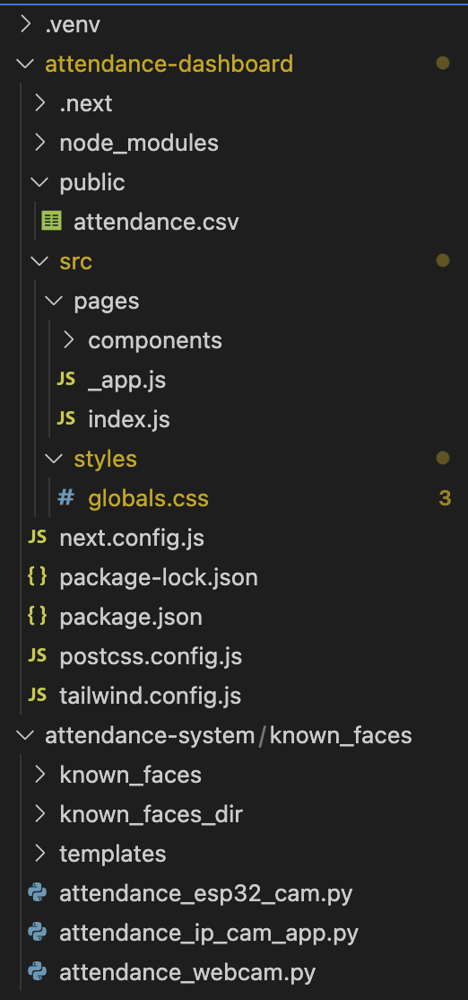

# Automated Attendance System using Facial Recognition

This project implements an automated attendance system leveraging facial recognition technology. It offers flexibility by supporting multiple image sources: a webcam, a smartphone camera (via IP Webcam), and an ESP32-CAM module.  The system identifies students, records their attendance in a CSV file, and integrates with a dashboard for visualization and analysis.

## Features

- **Multiple Input Sources:** Supports webcam, smartphone via IP Webcam, and ESP32-CAM.
- **Real-time Recognition:**  Identifies faces in real-time from the selected input source.
- **Automated Attendance Recording:** Automatically logs attendance with timestamps in a CSV file.
- **Dashboard Integration:**  Connects with a dedicated dashboard for attendance visualization and analysis (see [Attendance Dashboard](#attendance-dashboard)).
- **Efficient Face Recognition:**  Utilizes optimized face recognition libraries for fast and accurate identification.
- **Customizable:** Easily adaptable to different classroom settings and integration needs.

## Table of Contents
1. [Setup Instructions](#setup-instructions)
   - [Webcam Option](#webcam-option)
   - [Smartphone Option](#smartphone-option)
   - [ESP32-CAM Module](#esp32-cam-module)
2. [Face Recognition & Attendance Recording](#face-recognition--attendance-recording)
3. [Dashboard Setup](#dashboard-setup)
4. [File Structure](#file-structure)
5. [Installation & Dependencies](#installation--dependencies)

---

## Setup Instructions

### Webcam Option

Using the default webcam for attendance is straightforward:

1. **Run the webcam script:**

   ```bash
   python attendance_webcam.py
   ```

   This script captures images from the laptop’s webcam, performs face recognition, and logs attendance data.

---

### Smartphone Option

For smartphone usage, follow these steps:

1. **Install IP Webcam App:** Download and install the "IP Webcam" app on your smartphone.
2. **Network Setup:** Ensure both your laptop and smartphone are connected to the same local network.
3. **Configure the IP Webcam App:**
   - Open the IP Webcam app on your smartphone.
   - Tap “Start Server” to begin streaming.
   - Note the URL displayed, which looks like `http://192.168.x.x:8080`.
4. **Edit the Python Script:**
   - Open the `attendance_ip_cam_app.py` file.
   - In line 90, update the `ip_webcam_url` variable with your IP Webcam URL:
   
     ```python
     ip_webcam_url = 'http://192.168.x.x:8080/shot.jpg'  # IP Webcam snapshot URL
     ```

5. **Run the Script:**

   ```bash
   python attendance_ip_cam_app.py
   ```

---

### ESP32-CAM Module

To use an ESP32-CAM module, program it to capture images and send them to your system over a local network.

#### 1. ESP32 Setup and Programming

1. **Hardware Requirements:**
   - ESP32-CAM module
   - FTDI programmer (for initial programming)
   - Jumper wires

2. **Connections:**
   - Connect the ESP32-CAM’s GND to GND on the FTDI programmer.
   - Connect the ESP32-CAM’s U0R (RX) to the FTDI TX and U0T (TX) to FTDI RX.
   - Connect VCC to the 5V power line on the FTDI programmer.
   - Ensure the jumper is connected between GND and IO0 on the ESP32-CAM for programming mode.

3. **Programming the ESP32-CAM:**
   - Upload the `ESP32_CAM_CODE.ino` code file to your ESP32-CAM module. This file programs the ESP32-CAM to send images to the server.
   - Configure your Wi-Fi SSID and password in the `ESP32_CAM_CODE.ino` file:

     ```cpp
     const char* ssid = "Your_SSID";
     const char* password = "Your_Password";
     ```

4. **Update the Python Script:**
   - In line 90 of your attendance script, update the URL for the ESP32 camera:

     ```python
     esp32_url = 'http://192.168.x.x/capture'  # ESP32 camera capture URL
     ```

5. **Run the Script:**

   ```bash
   python attendance_esp32_cam.py
   ```

---

## Face Recognition & Attendance Recording

1. **Image Capture:** Each of the scripts above captures an image from the specified camera source.
2. **Face Recognition:** The system loads known faces from the `known_faces` directory.
   - Images should be named in the format: `rollno_prn_first_lastname_branch.jpg/jpeg`.
3. **Attendance Check:**
   - For each recognized face, it checks if the student’s attendance is already marked.
   - If not, attendance is logged in the `attendance.csv` file with details like Roll Number, PRN, First Name, Last Name, Division, Timestamp, and Classroom.

### `attendance.csv` Format
- Rollno, PRN, FirstName, LastName, Division, Time, Classroom

---

## Dashboard Setup

A dashboard, the **Attendance Dashboard**, processes the `attendance.csv` file and visualizes attendance data for easy tracking and analysis.

### Key Components
- **Tailwind CSS:** For styling.
- **Next.js Configuration:** The Next.js configuration and package files are provided for running the dashboard server locally.

### Sample Configuration Files
Here’s a sample setup (pre-configured in this project):

- `tailwind.config.js`: Configures Tailwind with Next.js
- `next.config.js`: Enables React strict mode for development

---

## File Structure

The main files and directories include:



```
- attendance_webcam.py          # Webcam-based attendance capture
- attendance_ip_cam_app.py      # Smartphone IP Webcam-based attendance capture
- ESP32_CAM_CODE.ino            # ESP32-CAM module setup code
- attendance.csv                # Stores attendance data
- known_faces/                  # Directory of images with known faces
- dashboard/                    # Dashboard for attendance data visualization
  └─ tailwind.config.js
  └─ next.config.js
  └─ pages/
  └─ components/
- requirements.txt              # Project dependencies
```

---

## Installation & Dependencies

### Requirements

To install the dependencies:

```bash
pip install -r requirements.txt
```

Dependencies include:
- OpenCV
- Face Recognition
- Requests
- Numpy
- Pandas
- PIL (Python Imaging Library)

### `requirements.txt` Example

```plaintext
opencv-python
face-recognition
requests
numpy
pandas
pillow
```

Now you’re ready to run the attendance monitoring system using any of the three camera options and visualize attendance records on the dashboard. For any questions or issues, feel free to reach out!
